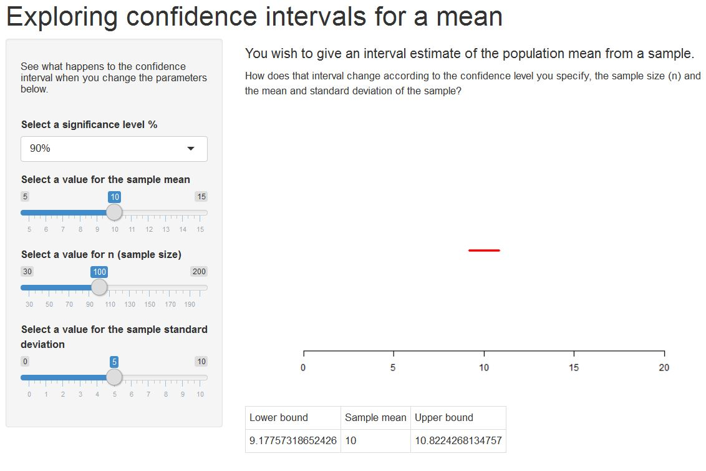

---


title       : Exploring Confidence Intervals
subtitle    : A shiny app for statistics students (and teachers)
author      : Victoria Hunt
job         : 
framework   : io2012        # {io2012, html5slides, shower, dzslides, ...}
highlighter : highlight.js  # {highlight.js, prettify, highlight}
hitheme     : tomorrow      # 
widgets     : [mathjax, quiz, bootstrap, shiny]         
mode        : selfcontained # {standalone, draft}
knit        : slidify::knit2slides
---


## Motivation behind the app
As a statistics teacher of 1st year political science undergraduate students, I notice they often have difficulties understanding confidence intervals and how the interval changes as certain parameters change.
<hr>
For a sample of size $n>30$ with sample mean $\bar x$ and standard deviation $s$ the confidence interval for the population mean is :-

$$\bar x \pm z {s \over \sqrt{n}}$$

where $z=2.58$ for a 99% interval $z=1.96$ for a 95% interval, $z=1.64$ for a 90% interval.

Does the interval get wider or narrower when you change $\bar x$ or $n$ etc ?

**This shiny app gives students the opportunity to graphically explore the answers to these questions.**

<hr>
<p style="font-size=0.5em"> NOTE: The students haven't seen the 't' distribution at this stage. </p>

--- &radio 

## Here's a typical question .....

_(in my experience a lot of students get this wrong!)_

You calculate a confidence interval for the mean of a population by taking a sample and using the sample mean and standard deviation to calculate the interval.


If nothing else changes, what can you say about a 95% confidence interval and a 90% confidence interval?

1. The 95% confidence interval is narrower than the 90% confidence interval
2. _The 95% confidence interval is wider than the 90% confidence interval_
3. It is impossible to say.

*** .hint
Imagine I asked you to predict the temperature tomorrow, by giving a range. If you wanted to play safe and be sure you were right, i.e. have a high probability that tomorrow's temperature does fall in the range, would you give a wide range, or a narrow range?

*** .explanation
The 95% confidence interval is wider. Use the Exploring Confidence Intervals app to see. 

---
## What the app does....
<table style="width:100%">
  <tr>
    <td style="width:60%">
    
    </td>
    <td>
    <p style="font-size: 1.2em"><b>So this shiny app allows students to change the parameters and see graphically how the confidence interval changes. They can use the select boxes and the sliders on the left and watch the red bar change.</b></p>
    <p style="font-size: 0.9em">In class I would encourage them to think about why the interval changes as it does.</p>
    <p style="font-size: 0.9em">For example as the sample size 'n' gets larger, the sample is better, we are more sure about our results so the interval gets narrower.</p>
    <p style="font-size: 0.9em">I would then encourage them to look at the formula, and reason mathematically why this is true ( root n is in the denominator....)</p> 
    </td> 
  </tr>
</table>
**After playing with the app, they will be better placed to answer a consolidation question...**


--- &radio

## And a consolidation question...

The three confidence intervals at 90%, 95%, and 99% for the population mean have been contructed from a sample with $n=100 , \bar x=10 , s=5$. 
Which line represents the 99% interval?

```{r echo=FALSE,fig.height=3, fig.align='center'}

mean=10
s=5
n=100
sig=c(90,95,99)

z<-qnorm(sig/200+0.5)
upper<-mean+z*s/n^0.5
lower<-mean-z*s/n^0.5

  
plot1<-plot(x=c(lower[1],upper[1]),y=c(0,0),type='l',xlim=c(5,15),yaxt='n',ann=FALSE, col="red", frame=FALSE, lwd=3, pin=c(1,1))
  lines(x=c(lower[2],upper[2]),y=c(0.5,0.5), col="green", lwd=3)
  lines(x=c(lower[3],upper[3]),y=c(1,1), col="blue", lwd=3)
  legend(0,0, c("90%", "95%", "99%"), col = c(4, 2, 3), lwd=3)


```


    
1. _the blue line_
2. the green line
3. the red line

*** .hint
Go back to the shiny app and test this.

*** .explanation
Well done! The 99% confidence interval is the widest. 
### This app could help your statistics students too.

publish(user = "Victoria-H", repo = "SlidifyCI")
